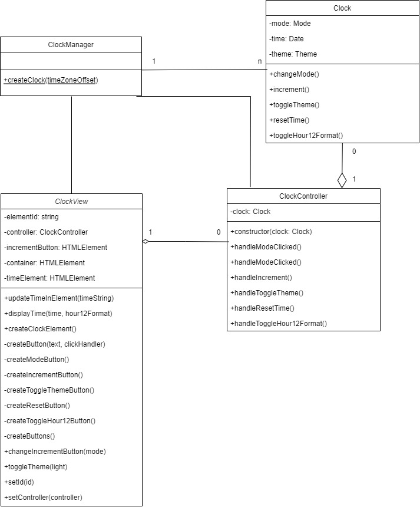

# Clock Project

## How to start

```javascript
npm install
npm run build
npm run start
```

## Class diagram

This project leverages MVC pattern and has the following classes:

- Clock View
- Clock
- ClockController
- ClockManger

The relationship between these classes is described in the below class diagram:


